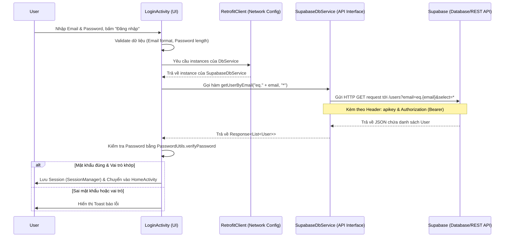

# Kiến trúc luồng xác thực (Login Flow) - Từ UI đến Supabase

Tài liệu này mô tả chi tiết một luồng (flow) hoàn chỉnh từ lúc người dùng tương tác trên giao diện (UI) cho đến khi dữ liệu được xử lý qua Backend (Retrofit API) và gọi tới Supabase Database. Luồng được chọn để phân tích là **Luồng Đăng nhập (Login Flow)**.

## 1. Các thành phần tham gia (System Components)

1. **User Interface (UI):** `LoginActivity.java` - Nơi người dùng nhập thông tin và tương tác.
2. **Network/Backend Client:** `RetrofitClient.java` - Cấu hình HTTP Client, quản lý các header cần thiết (API Key, Authorization) để giao tiếp với Supabase.
3. **API Service:** `SupabaseDbService.java` - Định nghĩa các endpoint (REST API) tương tác với các bảng trong Supabase.
4. **Database:** Supabase PostgreSQL - Nơi lưu trữ và truy vấn dữ liệu theo RESTful API.

---

## 2. Sơ đồ tương tác (Sequence Diagram)



---

## 3. Phân tích mã nguồn từng cấp độ (Code Analysis)

### Cấp độ 1: User Interface (UI) - `LoginActivity.java`
Khi người dùng bấm nút đăng nhập, hàm `handleLogin()` được gọi. Hàm này thay mặt người dùng validate dữ liệu và yêu cầu Retrofit gọi API.

```java
private void handleLogin() {
    String email = edtEmail.getText().toString().trim();
    String password = edtPassword.getText().toString().trim();

    // 1. Validation (Kiểm tra rỗng, định dạng email, độ dài password...)
    if (!ValidationUtils.isValidEmail(email)) { ... return; }

    progressDialog.show(); // Hiển thị loading cho người dùng

    // 2. Gọi API Service
    SupabaseDbService dbService = RetrofitClient.getDbService();
    
    // 3. Thực hiện truy vấn bất đồng bộ tới Supabase
    dbService.getUserByEmail("eq." + email, "*")
        .enqueue(new Callback<List<User>>() {
            @Override
            public void onResponse(Call<List<User>> call, Response<List<User>> response) {
                progressDialog.dismiss();
                if (response.isSuccessful() && response.body() != null && !response.body().isEmpty()) {
                    User user = response.body().get(0);

                    // 4. Xử lý Logic tại Client: Kiểm tra hash mật khẩu
                    if (!PasswordUtils.verifyPassword(password, user.getPassword())) {
                        Toast.makeText(LoginActivity.this, "Email hoặc mật khẩu không đúng!", Toast.LENGTH_SHORT).show();
                        return;
                    }
                    
                    // 5. Lưu phiên đăng nhập & chuyển hướng
                    sessionManager.saveAuthToken("custom_" + user.getId(), "");
                    sessionManager.saveUserInfo(user.getId(), ...);
                    navigateToMain();
                } else {
                    Toast.makeText(LoginActivity.this, "Tài khoản không tồn tại.", Toast.LENGTH_SHORT).show();
                }
            }

            @Override
            public void onFailure(Call<List<User>> call, Throwable t) {
                // Xử lý lỗi mạng
            }
        });
}
```

### Cấp độ 2: Network Client & Middleware - `RetrofitClient.java`
Để gọi được Supabase REST API, các request cần phải có các **Header** xác thực. Việc này được quản lý tự động bởi `Interceptor` trong `OkHttpClient`. Điều này giúp UI không cần bận tâm về việc cấu hình header ở mỗi lần gọi API.

```java
private static OkHttpClient createClient() {
    return new OkHttpClient.Builder()
            .addInterceptor(new Interceptor() {
                @Override
                public Response intercept(Chain chain) throws IOException {
                    Request original = chain.request();
                    
                    // Thêm tự động Header apikey và Content-Type vào mọi request
                    Request.Builder builder = original.newBuilder()
                            .header("apikey", SupabaseConfig.SUPABASE_ANON_KEY)
                            .header("Content-Type", "application/json");
                            
                    // Thêm Authorization (Bearer token)
                    if (original.header("Authorization") == null) {
                        builder.header("Authorization", "Bearer " + SupabaseConfig.SUPABASE_ANON_KEY);
                    }
                    
                    Request request = builder.method(original.method(), original.body()).build();
                    return chain.proceed(request);
                }
            }).build();
}
```

### Cấp độ 3: API Service Definition - `SupabaseDbService.java`
Đây là nơi định nghĩa các lời gọi API tương thích với [PostgREST API](https://postgrest.org/) của Supabase. Định dạng hàm sẽ quyết định endpoint, HTTP method và các tham số query lọc dữ liệu.

```java
public interface SupabaseDbService {
    // ==================== USERS ====================
    
    // Gửi HTTP GET request tới route "users"
    // Các tham số sẽ biến thành query parameters.
    // Ví dụ URL sinh ra: GET /rest/v1/users?email=eq.test@gmail.com&select=*
    @GET("users")
    Call<List<User>> getUserByEmail(
            @Query("email") String emailFilter,
            @Query("select") String select);
}
```

### Cấp độ 4: Supabase Database (Xử lý cuối cùng)
Dựa vào request `GET /rest/v1/users?email=eq.test@gmail.com&select=*` cùng với các Header hợp lệ:
1. **API Gateway (Kong)** của Supabase nhận request và kiểm tra xác thực dựa theo JWT/API key.
2. Request được chuyển qua **PostgREST** - dịch vụ tự động chuyển đổi REST API thành các câu lệnh truy vấn PostgreSQL.
3. PostgreSQL thực thi truy vấn nội bộ: `SELECT * FROM users WHERE email = 'test@gmail.com'`.
4. Dữ liệu được trả ngược lại về Client dưới dạng **JSON Array**.

## Tổng kết
Luồng đi hoàn chỉnh được xây dựng dựa trên kiến trúc n-tier mỏng (Thick Client - Thin Server qua REST API):
- **Hiệu quả:** Tách biệt rõ ràng phần giao diện, phần kết nối mạng và định nghĩa API.
- **Bảo mật:** Token/Key được quản lý ở mạng (Network Interceptor) giúp không bị rò rỉ hoặc phải cấu hình lặp lại ở UI.
- **Scale:** Với Backend-as-a-Service như Supabase, cơ sở hạ tầng cung cấp trực tiếp các API CRUD, Client chỉ việc tương tác theo chuẩn REST mà không cần tự xây dựng Backend riêng xử lý database.
