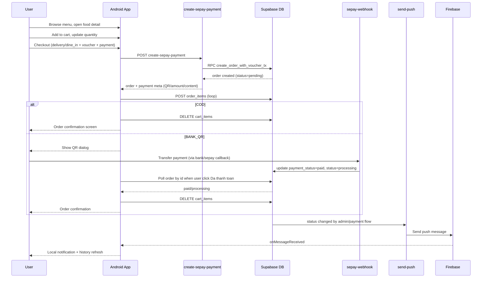

# Order Management Flow A-Z (Menu -> Cart -> Checkout -> Status -> Realtime)

Tai lieu nay tong hop lai toan bo luong xu ly order management da implement trong app Android, doi chieu truc tiep theo code hien tai.

## 0) Scope va muc tieu

Flow chinh:
- Menu browsing (duyet danh muc + mon an)
- Shopping cart (them/sua/xoa/undo)
- Multi-step checkout (delivery/dine_in + voucher + payment)
- Tao don + tao order_items + confirm
- Theo doi trang thai don (user + admin)
- Realtime update qua webhook + FCM push

Nguon code chinh:
- app/src/main/java/com/example/food_order_app/controller/HomeActivity.java
- app/src/main/java/com/example/food_order_app/controller/FoodDetailActivity.java
- app/src/main/java/com/example/food_order_app/controller/CartActivity.java
- app/src/main/java/com/example/food_order_app/controller/CheckoutActivity.java
- app/src/main/java/com/example/food_order_app/controller/OrderHistoryActivity.java
- app/src/main/java/com/example/food_order_app/controller/AdminOrdersActivity.java
- app/src/main/java/com/example/food_order_app/controller/AdminOrderDetailActivity.java
- supabase/functions/create-sepay-payment/index.ts
- supabase/functions/sepay-webhook/index.ts
- supabase/functions/send-push/index.ts

---

## A) App Entry va Router

Entry point app:
- app/src/main/java/com/example/food_order_app/MainActivity.java

Y nghia:
- Splash + dieu huong theo session.
- Neu da login + rememberMe:
  - admin -> AdminHomeActivity
  - user -> HomeActivity
- Dong thoi sync FCM token ngay tu dau.

Trich doan:

```java
if (sessionManager.isLoggedIn() && sessionManager.isRememberMe()) {
    PushRegistrationManager.requestCurrentTokenAndSync(this);
    if (sessionManager.isAdmin()) {
        intent = new Intent(MainActivity.this, AdminHomeActivity.class);
    } else {
        intent = new Intent(MainActivity.this, HomeActivity.class);
    }
} else {
    intent = new Intent(MainActivity.this, LoginActivity.class);
}
```

---

## B) Browse Menu (Home)

File:
- app/src/main/java/com/example/food_order_app/controller/HomeActivity.java

Diem quan trong:
- `loadData()` goi cac luong tai du lieu menu:
  - banner (`loadSystemBanners()`)
  - categories (`loadCategories()`)
  - foods (`loadRecommendedFoods()`)
  - hot offers (`loadHotOffers()`)
  - maybe-like (`loadMaybeLikeFoods()`)
- Chon category -> filter danh sach mon.
- Click card mon -> `openFoodDetail(food)`.

Trich doan:

```java
private void loadData() {
    loadFailCount = 0;
    if (!isNetworkAvailable()) {
        showNetworkError();
        Toast.makeText(this, "Không có kết nối mạng. Vui lòng kiểm tra WiFi/Data.", Toast.LENGTH_LONG).show();
        return;
    }
    loadSystemBanners();
    loadCategories();
    loadRecommendedFoods();
    loadMaybeLikeFoods();
    loadHotOffers();
}
```

```java
private void openFoodDetail(Food food) {
    Intent intent = new Intent(this, FoodDetailActivity.class);
    intent.putExtra("food_id", food.getId());
    startActivity(intent);
}
```

---

## C) Food Detail -> Add To Cart

File:
- app/src/main/java/com/example/food_order_app/controller/FoodDetailActivity.java

Flow them gio:
1. User bam Add to cart.
2. Kiem tra login.
3. Tim cart theo `user_id`:
   - da co cart -> them/sua item
   - chua co cart -> tao cart roi them
4. Neu mon da ton tai trong cart -> tang quantity.
5. Neu chua ton tai -> insert moi `cart_items`.

Trich doan:

```java
private void addToCart() {
    if (!sessionManager.isLoggedIn()) {
        Toast.makeText(this, "Vui lòng đăng nhập", Toast.LENGTH_SHORT).show();
        return;
    }

    String userId = sessionManager.getUserId();
    dbService.getCart("eq." + userId).enqueue(new Callback<List<Cart>>() {
        @Override
        public void onResponse(Call<List<Cart>> call, Response<List<Cart>> response) {
            if (response.isSuccessful() && response.body() != null && !response.body().isEmpty()) {
                addItemToCart(response.body().get(0).getId());
            } else {
                // Create new cart then add item
            }
        }
    });
}
```

```java
private void addItemToCart(String cartId) {
    dbService.getCartItems("eq." + cartId, "eq." + foodId, "*,foods(*)").enqueue(new Callback<List<CartItem>>() {
        @Override
        public void onResponse(Call<List<CartItem>> call, Response<List<CartItem>> response) {
            if (response.isSuccessful() && response.body() != null && !response.body().isEmpty()) {
                CartItem existingItem = response.body().get(0);
                int newQty = existingItem.getQuantity() + quantity;
                // update quantity
            } else {
                // insert cart_items moi
            }
        }
    });
}
```

---

## D) Cart Management (Xem/Sua/Xoa/Undo)

File:
- app/src/main/java/com/example/food_order_app/controller/CartActivity.java
- app/src/main/java/com/example/food_order_app/adapter/CartAdapter.java

Logic:
- `loadCart()` -> lay cart theo user.
- `loadCartItems()` -> lay items join foods: `select=*,foods(*)`.
- Quantity +/- goi `updateCartItem`.
- Swipe trai de xoa + snackbar Undo (`deleteItemWithUndo`).
- Clear all cart cung co Undo (`clearCartWithUndo`).
- Tong tien tinh tu `CartItem.getSubtotal()`.

Trich doan swipe + undo:

```java
private void deleteItemWithUndo(CartItem item, int position) {
    cartAdapter.removeItem(position);
    updateTotal();

    Snackbar.make(findViewById(android.R.id.content),
            "Dã xóa: " + itemName, Snackbar.LENGTH_LONG)
            .setAction("Hoàn tác", v -> {
                cartAdapter.addItemAt(position, item);
                updateTotal();
                showCartItems();
            })
            .addCallback(new Snackbar.Callback() {
                @Override
                public void onDismissed(Snackbar sb, int event) {
                    if (event != DISMISS_EVENT_ACTION) {
                        dbService.deleteCartItem("eq." + item.getId()).enqueue(...);
                    }
                }
            }).show();
}
```

Trich doan subtotal model:

```java
public double getSubtotal() {
    if (food == null) return 0;
    return food.getDiscountedPrice() * quantity;
}
```

---

## E) Multi-Step Checkout (Tong quan)

File:
- app/src/main/java/com/example/food_order_app/controller/CheckoutActivity.java

Cac buoc chinh trong 1 man hinh:
1. Chon loai don: `delivery` hoac `dine_in`.
2. Delivery: chon dia chi; Dine-in: nhap ten + so ban.
3. Chon/ap dung voucher.
4. Chon payment: COD hoac Banking QR.
5. Place order -> call Edge Function -> tao order_items -> branch theo payment.

---

## F) Delivery vs Dine-in Validation

Trich doan:

```java
rgOrderType.setOnCheckedChangeListener((group, checkedId) -> {
    isDineIn = (checkedId == R.id.rbDineIn);
    layoutDeliveryAddress.setVisibility(isDineIn ? View.GONE : View.VISIBLE);
    layoutDineIn.setVisibility(isDineIn ? View.VISIBLE : View.GONE);
});
```

```java
if (!isDineIn) {
    if (selectedReceiverName == null || selectedPhone == null || selectedAddressText == null) {
        Toast.makeText(this, "Vui lòng chọn địa chỉ giao hàng", Toast.LENGTH_SHORT).show();
        return;
    }
} else {
    String dineInName = edtDineInName.getText().toString().trim();
    String dineInTable = edtDineInTable.getText().toString().trim();
    if (dineInName.isEmpty() || dineInTable.isEmpty()) {
        Toast.makeText(this, "Vui lòng nhập tên và số bàn", Toast.LENGTH_SHORT).show();
        return;
    }
}
```

---

## G) Voucher Validation (Client-side)

File:
- app/src/main/java/com/example/food_order_app/controller/CheckoutActivity.java

`evaluateVoucherEligibility(...)` check:
- voucher null/inactive
- start_date/end_date
- min_order_value
- usage_limit/used_count
- da su dung boi user chua (`usedVoucherIds`)

Trich doan:

```java
private VoucherEligibility evaluateVoucherEligibility(Voucher voucher, Set<String> usedVoucherIds) {
    if (voucher == null) return new VoucherEligibility(false, "Voucher không hợp lệ");
    if (!voucher.isActive()) return new VoucherEligibility(false, "Voucher đã bị vô hiệu hóa");

    long now = System.currentTimeMillis();
    long startMillis = parseServerDateMillis(voucher.getStartDate());
    long endMillis = parseServerDateMillis(voucher.getEndDate());

    if (startMillis > 0 && now < startMillis) return new VoucherEligibility(false, "Chưa tới thời gian áp dụng");
    if (endMillis > 0 && now > endMillis) return new VoucherEligibility(false, "Voucher đã hết hạn");
    if (totalAmount < voucher.getMinOrderValue()) return new VoucherEligibility(false, "Đơn tối thiểu ...");

    return new VoucherEligibility(true, "");
}
```

Sau do:
- `handleApplyVoucher()` tra voucher theo code.
- `validateVoucherUsageBeforeApply()` check lich su su dung user.
- `handleApplyVoucherReal()` tinh discount (`percent`/`fixed_amount`).

---

## H) Place Order va payload gui Edge

Trich doan:

```java
String paymentMethod = rgPayment.getCheckedRadioButtonId() == R.id.rbCOD ? "cod" : "banking";
String orderType = isDineIn ? "dine_in" : "delivery";
String orderCode = "ORD-" + UUID.randomUUID().toString().substring(0, 8).toUpperCase();

boolean isBanking = rgPayment.getCheckedRadioButtonId() == R.id.rbBanking;
createOrderViaEdge(orderCode, note, orderType, paymentMethod, isBanking);
```

```java
Map<String, Object> payload = new HashMap<>();
payload.put("user_id", sessionManager.getUserId());
payload.put("order_code", orderCode);
payload.put("subtotal", totalAmount);
payload.put("payment_mode", isBanking ? "BANK_QR" : "COD");
payload.put("payment_method", paymentMethod);
payload.put("order_type", orderType);
if (appliedVoucherCode != null) payload.put("voucher_code", appliedVoucherCode);
```

Endpoint app goi:
- `SupabaseEdgeService.createSepayPayment(...)`
- network interface: app/src/main/java/com/example/food_order_app/network/SupabaseEdgeService.java

---

## I) Edge Function create-sepay-payment

File:
- supabase/functions/create-sepay-payment/index.ts

Chuc nang:
1. Parse body + validate field bat buoc.
2. Neu co voucher_code: query voucher, check active/date/min_order/usage, tinh discount.
3. Xay transfer content: `FOODAPP ORD-xxxx`.
4. Tao QR URL (VietQR) neu `BANK_QR`/`SEPAY_CHECKOUT`.
5. Goi RPC `create_order_with_voucher_tx` de tao order atomically.
6. Tra ve `{ order, payment }` cho app.

Trich doan:

```ts
const { data: insertedOrder, error: orderError } = await sb.rpc("create_order_with_voucher_tx", {
  p_user_id: body.user_id,
  p_order_code: body.order_code,
  p_receiver_name: receiverName,
  p_phone: phone,
  p_address: address,
  p_payment_method: paymentMethod,
  p_subtotal: body.subtotal,
  p_order_type: body.order_type ?? "delivery",
  p_payment_status: "pending",
  p_payment_reference: paymentContent,
  p_payment_qr_url: paymentMode === "BANK_QR" ? qrUrl : null,
  p_voucher_code: voucherCodeToApply,
});
```

```ts
return new Response(JSON.stringify({
  success: true,
  order: orderData,
  payment: {
    provider: "sepay",
    mode: paymentMode,
    qr_url: paymentMode === "BANK_QR" ? qrUrl : null,
    transfer_content: paymentContent,
    amount: Math.round(totalAmount),
  },
}));
```

---

## J) Tao order_items sau khi co order_id

File:
- app/src/main/java/com/example/food_order_app/controller/CheckoutActivity.java

Sau khi Edge tra order ID:
- app loop qua `cartItems`
- insert tung dong vao `order_items`
- done het ->
  - Banking: mo QR dialog
  - COD: clear cart va di confirmation

Trich doan:

```java
for (CartItem item : cartItems) {
    Map<String, Object> itemData = new HashMap<>();
    itemData.put("order_id", orderId);
    itemData.put("food_id", item.getFoodId());
    itemData.put("food_name", item.getFood() != null ? item.getFood().getName() : "");
    itemData.put("price", item.getFood() != null ? item.getFood().getDiscountedPrice() : 0);
    itemData.put("quantity", item.getQuantity());
    itemData.put("subtotal", item.getSubtotal());
    dbService.createOrderItem(itemData).enqueue(...);
}
```

---

## K) Payment Branch

### K1. COD

- Tao order thanh cong.
- `clearCartAndFinish(...)` -> `OrderConfirmationActivity`.

```java
if (waitForPayment && bankingMeta != null) {
    showBankingQrDialog(orderId, orderCode, bankingMeta);
} else {
    clearCartAndFinish(orderCode, finalAmount);
}
```

### K2. Banking QR

- Hien QR popup voi amount + transfer content.
- User bam "Da thanh toan" -> app query lai order (`payment_status`, `status`).
- Neu `paid` hoac `processing` -> complete flow.

```java
boolean paid = "paid".equalsIgnoreCase(order.getPaymentStatus());
boolean processing = "processing".equalsIgnoreCase(order.getStatus());

if (paid || processing) {
    dialog.dismiss();
    clearCartAndFinish(orderCode, paidAmount);
}
```

---

## L) Webhook Payment (Server-side verification)

File:
- supabase/functions/sepay-webhook/index.ts

Flow:
1. Verify secret (`Authorization: Apikey ...` hoac legacy header).
2. Parse payload thanh cong (`isSuccessPayload`).
3. Rut `payment_reference` tu transfer content.
4. Match order theo `payment_reference`.
5. Verify amount phai khop chinh xac `order.total_amount`.
6. Update order:
   - `payment_status = paid`
   - `status = processing`
   - `paid_at = now`

Trich doan:

```ts
const { error: updateErr } = await sb
  .from("orders")
  .update({
    payment_status: "paid",
    paid_at: new Date().toISOString(),
    status: "processing",
  })
  .eq("id", order.id);
```

---

## M) User Tracking (OrderHistory)

File:
- app/src/main/java/com/example/food_order_app/controller/OrderHistoryActivity.java
- app/src/main/java/com/example/food_order_app/adapter/OrderHistoryAdapter.java

Chuc nang:
- Tai don theo user `created_at.desc`.
- Filter status: `all/pending/processing/delivering/served/cancelled`.
- Expand card de xem order_items.
- Huy don khi dang `pending`.
- Dat lai (reorder) -> add item vao cart -> mo CartActivity.

Trich doan filter:

```java
private void filterOrders() {
    List<Order> filtered = new ArrayList<>();
    for (Order o : allOrders) {
        if (currentFilter.equals("all") || currentFilter.equals(o.getStatus())) {
            filtered.add(o);
        }
    }
    if (filtered.isEmpty()) showEmpty(...);
    else adapter.setOrders(filtered);
}
```

Trich doan cancel pending:

```java
if ("pending".equals(status)) {
    btnCancelOrder.setVisibility(View.VISIBLE);
    btnCancelOrder.setOnClickListener(v -> showCancelDialog(order));
} else {
    btnCancelOrder.setVisibility(View.GONE);
}
```

---

## N) Admin Management (List + Detail + Quick Actions)

Files:
- app/src/main/java/com/example/food_order_app/controller/AdminOrdersActivity.java
- app/src/main/java/com/example/food_order_app/controller/AdminOrderDetailActivity.java
- app/src/main/java/com/example/food_order_app/adapter/AdminOrderAdapter.java

Admin co 2 cach update trang thai:
1. Trong list (quick actions)
2. Trong detail (buttons + confirm dialog)

Transitions thuc te trong app:
- `pending -> processing`
- `processing -> delivering` (delivery)
- `processing -> served` (dine_in)
- `delivering -> served`
- `pending/processing -> cancelled`

Trich doan detail update:

```java
private void updateStatus(String newStatus) {
    Map<String, Object> updates = new HashMap<>();
    updates.put("status", newStatus);

    dbService.updateOrderStatus("eq." + orderId, updates).enqueue(new Callback<List<Order>>() {
        @Override
        public void onResponse(Call<List<Order>> call, Response<List<Order>> response) {
            if (response.isSuccessful()) {
                currentStatus = newStatus;
                updateStatusUI();
                sendNotification(newStatus);
            }
        }
    });
}
```

---

## O) Realtime Update (Notification pipeline)

Thanh phan:
1. Admin update status -> tao row `notifications` -> call edge `send-push`.
2. Edge `send-push`:
   - doc `device_tokens`
   - gui FCM (legacy key hoac HTTP v1 service account)
   - ghi `notification_deliveries`
3. App nhan push:
   - `AppFirebaseMessagingService.onMessageReceived(...)`
   - show local notification qua `NotificationHelper`.

Trich doan FCM service:

```java
@Override
public void onMessageReceived(@NonNull RemoteMessage remoteMessage) {
    super.onMessageReceived(remoteMessage);
    String title = null;
    String body = null;
    if (remoteMessage.getNotification() != null) {
        title = remoteMessage.getNotification().getTitle();
        body = remoteMessage.getNotification().getBody();
    }
    Map<String, String> data = remoteMessage.getData();
    NotificationHelper.showPushNotification(getApplicationContext(), title, body, data);
}
```

---

## P) API Contracts (App <-> Supabase)

Service interface:
- app/src/main/java/com/example/food_order_app/network/SupabaseDbService.java

Nhom endpoint order/cart:
- `GET carts?user_id=eq.{userId}`
- `POST carts`
- `GET cart_items?cart_id=eq.{cartId}&select=*,foods(*)`
- `PATCH cart_items?id=eq.{itemId}`
- `DELETE cart_items?id=eq.{itemId}`
- `DELETE cart_items?cart_id=eq.{cartId}`
- `POST orders` (legacy path, hien tai checkout dung edge)
- `GET orders?user_id=eq.{userId}`
- `PATCH orders?id=eq.{orderId}` (update status)
- `POST order_items`
- `GET vouchers`, `GET voucher by code`
- `GET user_voucher_usage`

Interceptor auth header:
- app/src/main/java/com/example/food_order_app/network/RetrofitClient.java

```java
Request.Builder builder = original.newBuilder()
    .header("apikey", SupabaseConfig.SUPABASE_ANON_KEY)
    .header("Content-Type", "application/json");
if (original.header("Authorization") == null) {
    builder.header("Authorization", "Bearer " + SupabaseConfig.SUPABASE_ANON_KEY);
}
```

---

## Q) Data Model can nho

- `Order`: id, order_code, status, order_type, payment_method, payment_status, subtotal, discount_amount, total_amount
- `OrderItem`: order_id, food_id, food_name, quantity, price, subtotal
- `CartItem`: cart_id, food_id, quantity, foods(joined)
- `Voucher`: discount_type, discount_value, max_discount_amount, min_order_value, usage_limit, used_count, start/end date

Model files:
- app/src/main/java/com/example/food_order_app/model/Order.java
- app/src/main/java/com/example/food_order_app/model/OrderItem.java
- app/src/main/java/com/example/food_order_app/model/CartItem.java
- app/src/main/java/com/example/food_order_app/model/Voucher.java

---

## R) State Machine (status) - Mapping de on thi

### Trang thai app dang su dung trong Java/UI
- `pending`
- `processing`
- `delivering`
- `served`
- `cancelled`

### Mapping theo cach goi business thong dung
- pending = cho xac nhan
- confirmed/preparing = processing (app gom 2 giai doan nay thanh `processing`)
- delivery = delivering
- completed = served

### Luu y consistency
Trong `supabase_schema.sql` co check constraint cu:
- `('pending', 'confirmed', 'preparing', 'delivering', 'delivered', 'cancelled')`

Trong app code lai dung:
- `processing`, `served`

Neu DB environment chua migration/sync check constraint, update status tu app co the fail do status value mismatch.

---

## S) SQL va RPC lien quan

File:
- voucher_admin_feature_migration.sql
- supabase_edge_migration.sql
- push_notifications_migration.sql

Chuc nang quan trong:
- Tao `user_voucher_usage` de chong dung voucher lap.
- RPC `create_order_with_voucher_tx(...)` tao order + voucher tracking trong 1 transaction.
- Bo sung cot payment:
  - `payment_status`
  - `payment_reference`
  - `payment_qr_url`
  - `paid_at`
- Bang push:
  - `device_tokens`
  - `notification_deliveries`

Trich doan check duplicate voucher trong RPC:

```sql
IF EXISTS (
  SELECT 1 FROM public.user_voucher_usage uvu
  WHERE uvu.user_id = p_user_id
    AND uvu.voucher_id = v_voucher.id
) THEN
  RAISE EXCEPTION 'Voucher already used by this account';
END IF;
```

---

## T) Sequence tong the (A->Z)



---

## U) Cac diem de on thi nhanh (checklist)

1. Ban co nho duoc app tao cart khi nao, update quantity khi nao khong?
2. Ban co nho branch COD vs Banking khac nhau o dau?
3. Ban co nho Edge function nao tao order, webhook nao chot payment?
4. Ban co nho vi tri status transition cua admin va user cancel?
5. Ban co nho vi tri tao push + nhan push + show notification?
6. Ban co nho voucher duoc validate ca client va server nhu the nao?
7. Ban co nho rui ro mismatch status (`processing/served` vs `confirmed/preparing/delivered`) khong?

---

## V) Toa do code quan trong (de mo nhanh)

- Main router: app/src/main/java/com/example/food_order_app/MainActivity.java
- Home load data: app/src/main/java/com/example/food_order_app/controller/HomeActivity.java (loadData, loadRecommendedFoods)
- Add to cart: app/src/main/java/com/example/food_order_app/controller/FoodDetailActivity.java (addToCart, addItemToCart)
- Cart + undo: app/src/main/java/com/example/food_order_app/controller/CartActivity.java (deleteItemWithUndo)
- Checkout core: app/src/main/java/com/example/food_order_app/controller/CheckoutActivity.java
  - showVoucherSelectionDialog
  - evaluateVoucherEligibility
  - handleApplyVoucher
  - placeOrder
  - createOrderViaEdge
  - createOrderItems
  - showBankingQrDialog
  - verifyWebhookPaymentThenFinish
- User history: app/src/main/java/com/example/food_order_app/controller/OrderHistoryActivity.java
- Admin status update: app/src/main/java/com/example/food_order_app/controller/AdminOrderDetailActivity.java
- Admin quick action: app/src/main/java/com/example/food_order_app/adapter/AdminOrderAdapter.java
- Edge create payment: supabase/functions/create-sepay-payment/index.ts
- Webhook payment verify: supabase/functions/sepay-webhook/index.ts
- Push sender: supabase/functions/send-push/index.ts
- API contract: app/src/main/java/com/example/food_order_app/network/SupabaseDbService.java
- Schema/migration: supabase_schema.sql, voucher_admin_feature_migration.sql, supabase_edge_migration.sql, push_notifications_migration.sql

---

## Z) Tong ket 1 cau

Flow hien tai da day du tu browse -> cart -> checkout -> create order -> payment -> status tracking -> realtime push, va phan quan trong nhat can nho khi review la consistency status giua app va DB constraint.
